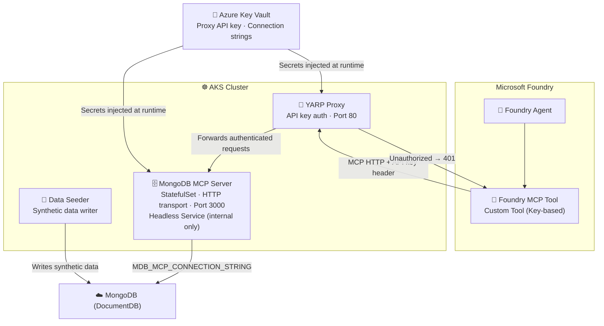
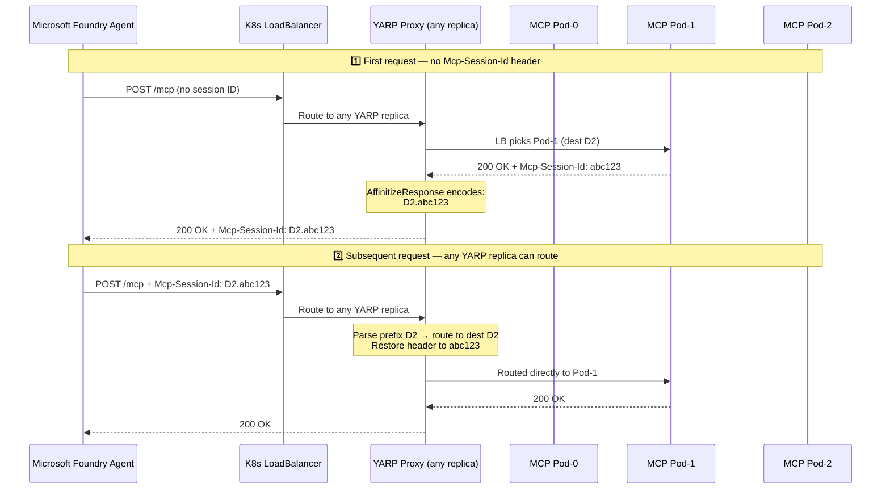

# 🔀 MCP YARP Gateway

**A Secure Reverse Proxy for Model Context Protocol Traffic on Azure Kubernetes Service**

MCP YARP Gateway provides a production-oriented MCP access path on AKS where Microsoft Foundry agents communicate through a hardened YARP proxy layer to backend MCP tool servers — enforcing API key authentication and preserving HTTP streaming behavior.

> **Flow:** Microsoft Foundry Agent → YARP Proxy (API key auth) → MongoDB MCP Server (HTTP transport) → Azure Cosmos DB for MongoDB (DocumentDB)

---

## 🎯 Overview

This project secures and standardizes MCP HTTP traffic on AKS using a YARP reverse proxy as an authenticated gateway. Instead of exposing MCP tool servers directly, all agent traffic is routed through the proxy, which enforces API key authentication and forwards requests to internal-only MCP services.

**Key capabilities:**
- YARP reverse proxy enforcing API key authentication for all MCP traffic
- MongoDB MCP Server running in AKS with HTTP transport (internal ClusterIP only)
- Azure Cosmos DB for MongoDB (DocumentDB) as the backing data store
- Microsoft Foundry Agent integration via proxied MCP endpoint
- Synthetic data seeder for populating DocumentDB with test data
- Kubernetes-native deployment via Helm charts
- Azure-native infrastructure provisioned with Bicep

---

## 📐 Architecture



### MCP Session Affinity

When the MongoDB MCP Server is scaled to multiple replicas, MCP sessions must be pinned to the pod that created them — otherwise follow-up requests return `404`, `500`. YARP uses a custom `McpSessionId` affinity policy backed by a StatefulSet with per-pod DNS routing.



**Key design decisions:**

| Concern | Solution |
|---|---|
| **Stable per-pod DNS** | StatefulSet + headless Service gives each pod a predictable address |
| **Session → Pod mapping** | Stateless: destination ID encoded into `Mcp-Session-Id` header (`D2.abc123`) |
| **Multi-YARP-replica support** | Fully stateless — any YARP replica can parse the header and route correctly |
| **Pod failure** | Destination not found in cluster → YARP redistributes; MCP client re-initialises |

### Core Components

| Component | Technology | Role |
|---|---|---|
| **YARP Proxy** | .NET 8, YARP | API key enforcement, HTTP request forwarding, MCP session affinity |
| **MongoDB MCP Server** | Node.js, MCP SDK | MCP tool server over HTTP transport |
| **Azure Cosmos DB for MongoDB** | Azure PaaS | DocumentDB backing store (DocumentDB API) |
| **Data Seeder** | Python | Continuous synthetic data writer |
| **Microsoft Foundry Agent** | Microsoft Foundry | AI agent consuming MCP tools via proxy |

---

## 📁 Project Structure

<details>
<summary>Expand to view repository layout</summary>

```
mcp-yarp-gateway/
├── deploy.ps1                          # Full end-to-end deployment orchestrator
├── README.md                           # This file
│
├── apps/
│   ├── yarp-proxy/                     # .NET 8 YARP reverse proxy
│   │   ├── Program.cs                  # Entry point, middleware, proxy config
│   │   ├── McpSessionAffinityPolicy.cs # Custom YARP session affinity (MCP session → pod pinning)
│   │   ├── Proxy.csproj
│   │   ├── appsettings.json            # Proxy routes, cluster destinations, auth config
│   │   ├── appsettings.Development.json
│   │   └── Dockerfile
│   └── data-seeder/                    # Python synthetic data seeder
│       ├── src/
│       │   └── generator.py            # Data generation logic
│       └── Dockerfile
│
├── infra/                              # Infrastructure as Code (Bicep)
│   ├── main.bicep                      # Subscription-scoped main template
│   └── core/
│       ├── ai/                         # Microsoft Foundry (account, project, models)
│       ├── data/
│       │   └── mongodb/                # Cosmos DB for MongoDB
│       ├── monitor/                    # Log Analytics, App Insights
│       ├── platform/                   # AKS, Container Registry
│       └── security/                   # Key Vault, Managed Identity, RBAC
│
├── k8s/helm/
│   ├── mcp-tools/                      # Namespace bootstrap (creates tools namespace)
│   ├── yarp-proxy/                     # YARP proxy Helm chart (port 80)
│   ├── mongodb-mcp-server/             # MongoDB MCP server chart (internal, port 3000)
│   ├── data-seeder/                    # Synthetic data seeder chart
│   └── platform/                       # Shared platform resources (Prometheus, Grafana)
│
└── scripts/
    ├── Deploy-Infrastructure.ps1       # Phase 1: Bicep infra deployment
    ├── Deploy-Containers.ps1           # Phase 2: ACR image build & push
    ├── Deploy-Kubernetes.ps1           # Phase 3: Helm chart deployments
    ├── Deploy-FoundryAgents.ps1        # Phase 4: Microsoft Foundry agent setup
    └── common/
        └── DeploymentFunctions.psm1    # Shared PowerShell utilities
```

</details>

---

## 🚀 Deployment

### Prerequisites

| Tool | Version | Notes |
|---|---|---|
| Azure CLI | Latest | `az login` authenticated |
| PowerShell | 7+ | Required for deployment scripts |
| Helm | 3+ | Required for Kubernetes deployments |
| Azure subscription | — | Sufficient quota for AKS, Cosmos DB, Microsoft Foundry, ACR |

> No Docker required locally — container images are built in Azure Container Registry via `az acr build`.

### 1. Clone the Repository

```bash
git clone https://github.com/jonathanscholtes/mcp-yarp-gateway.git
cd mcp-yarp-gateway
```

### 2. Deploy Everything (Single Command)

```powershell
az login
az account set --subscription "YOUR-SUBSCRIPTION-ID"

.\deploy.ps1 `
    -Subscription "YOUR-SUBSCRIPTION-ID" `
    -Location "eastus2" `
    -UserObjectId "YOUR-AAD-OBJECT-ID" `
    -AILocation 'westus3' [optional]
```

Get your Object ID with:
```powershell
az ad signed-in-user show --query id -o tsv
```

**The deployment runs four phases automatically:**

| Phase | Script | What it does |
|---|---|---|
| 1 — Infrastructure | `Deploy-Infrastructure.ps1` | Creates all Azure resources via Bicep |
| 2 — Container Images | `Deploy-Containers.ps1` | Builds & pushes proxy and seeder images to ACR |
| 3 — Kubernetes | `Deploy-Kubernetes.ps1` | Deploys Helm charts to AKS |
| 4 — Foundry Agents | `Deploy-FoundryAgents.ps1` | Configures Microsoft Foundry agents |

**Resources created (~15–20 min):**

- Azure Kubernetes Service (AKS) cluster
- Azure Container Registry (proxy + seeder images)
- Azure Cosmos DB for MongoDB (DocumentDB backing store)
- Azure Key Vault + Managed Identity (secretless auth throughout)
- Microsoft Foundry (account, project, model deployment)
- Log Analytics Workspace + Application Insights

---

## 🔧 Configuration

<details>
<summary>Expand to view environment variable reference</summary>

### YARP Proxy Settings

| Variable | Default | Description |
|---|---|---|
| `Proxy:ApiKeyHeader` / `PROXY__APIKEYHEADER` | `api-key` | Header name checked for API key |
| `Proxy:ApiKey` / `PROXY__APIKEY` | — | Expected API key value (from Key Vault) |
| `Proxy:UpstreamTimeoutMinutes` / `PROXY__UPSTREAMTIMEOUTMINUTES` | `5` | Timeout for upstream MCP calls |
| `ReverseProxy:Clusters:mcp-cluster:Destinations:d1:Address` | — | Per-pod URL for MCP server pod 0 |
| `ReverseProxy:Clusters:mcp-cluster:Destinations:d2:Address` | — | Per-pod URL for MCP server pod 1 |
| `ReverseProxy:Clusters:mcp-cluster:Destinations:d3:Address` | — | Per-pod URL for MCP server pod 2 |

### MongoDB MCP Server Settings

| Variable | Default | Description |
|---|---|---|
| `MDB_MCP_CONNECTION_STRING` | — | DocumentDB connection string (from Key Vault) |
| `MDB_MCP_TRANSPORT` | `http` | Transport mode (`http` for proxy connectivity) |
| `MDB_MCP_HTTP_HOST` | `0.0.0.0` | Bind host |
| `MDB_MCP_HTTP_PORT` | `3000` | Service port |
| `MDB_MCP_READ_ONLY` | `true` | Restrict to read-only MCP tools (recommended) |
| `MDB_MCP_DISABLED_TOOLS` | — | Comma-separated list of tools to disable |
| `MDB_MCP_TELEMETRY` | — | Set to `disabled` if required by policy |

### Agent / Notebook Variables

| Variable | Description |
|---|---|
| `PROJECT_ENDPOINT` | Microsoft Foundry project endpoint URL |
| `MODEL_DEPLOYMENT_NAME` | Model deployment name |
| `MCP_SERVER_LABEL` | Label for MCP server registration |
| `MCP_SERVER_URL` | Set to YARP proxy endpoint (not MongoDB MCP directly) |

Authentication to AKS, Cosmos DB, and Key Vault uses **Managed Identity** — no connection strings or secrets committed in the repo.

</details>

---

## 🔐 Security Model

- Agent only communicates with the YARP proxy endpoint — never directly with MCP servers.
- YARP enforces API key header on every request and returns `401` for unauthorized calls.
- MongoDB MCP server is not internet-exposed; it is reachable only from within the cluster.
- Secrets are injected at runtime from Azure Key Vault — no credentials committed to source control.
- TLS termination is handled at the ingress/gateway layer.

---

## ✅ Validation Checklist

- [ ] YARP proxy pod is healthy and serving the `/mcp/*` route
- [ ] MongoDB MCP server pod is healthy with HTTP transport enabled
- [ ] `MDB_MCP_CONNECTION_STRING` resolves and connects to DocumentDB
- [ ] Unauthorized proxy calls return `401`
- [ ] Authorized proxy calls return successful MCP responses
- [ ] AI Foundry agent run succeeds using the proxy URL with expected tools available

---

## 🔌 Post-Deployment: Add Foundry MCP Connection

After deployment completes, register the YARP proxy as a custom MCP tool in your Foundry project so agents can reach it. The YARP proxy external IP and API key are printed in the deployment summary at the end of `deploy.ps1`.

1. Open your Foundry project in [ai.azure.com](https://ai.azure.com/).
2. Go to **Build → Tools** (or open **Agent Builder**).
3. Select **Add tool → Custom → Model Context Protocol**.
4. Enter the following details:

| Field | Value |
|---|---|
| Name | `yarp-proxy-mcp` |
| Remote MCP Server endpoint | `http://<YARP_PROXY_IP>/mcp` |
| Authentication | Key-based |
| Credential | `"api-key": "<proxy-api-key>"` |

5. Select **Connect**.

> For full details on connecting custom MCP tools see [Connect using a custom MCP tool](https://learn.microsoft.com/en-us/azure/ai-foundry/mcp/build-your-own-mcp-server?view=foundry#connect-using-a-custom-mcp-tool).

---

## ♻️ Clean Up

After completing testing or when no longer needed, ensure you delete any unused Azure resources or remove the entire Resource Group to avoid additional charges.

---

## 📜 License

This project is licensed under the [MIT License](LICENSE.md).

---

## ⚠️ Disclaimer

**THIS CODE IS PROVIDED FOR EDUCATIONAL AND DEMONSTRATION PURPOSES ONLY.**

This sample code is not intended for production use and is provided "AS IS", without warranty of any kind, express or implied, including but not limited to the warranties of merchantability, fitness for a particular purpose, and noninfringement. In no event shall the authors or copyright holders be liable for any claim, damages, or other liability, whether in an action of contract, tort, or otherwise, arising from, out of, or in connection with the software or the use or other dealings in the software.

**Key Points:**
- This is a **demonstration project** showcasing autonomous agentic architecture patterns
- **Not intended for production** without significant additional development, testing, and compliance review
- Calculations are simplified models for demonstration purposes only
- Users are responsible for ensuring compliance with applicable regulations and security requirements
- Microsoft Azure services incur costs - monitor your usage and clean up resources when done
- No warranties or guarantees are provided regarding accuracy, reliability, or suitability for any purpose

By using this code, you acknowledge that you understand these limitations and accept full responsibility for any consequences of its use.
